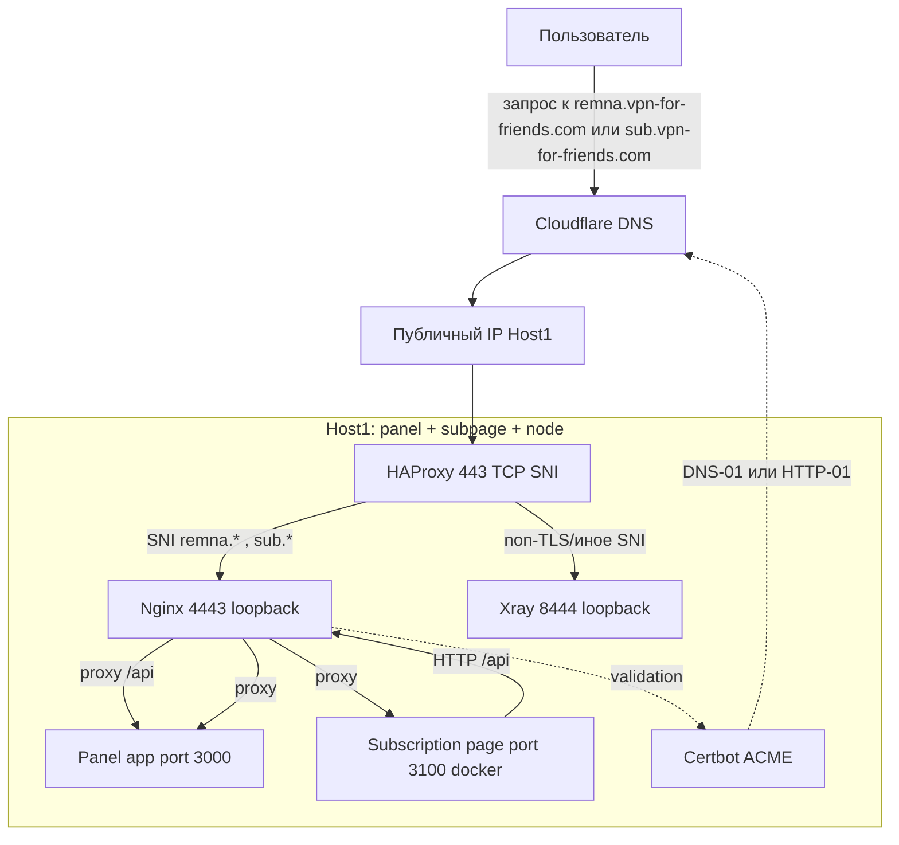
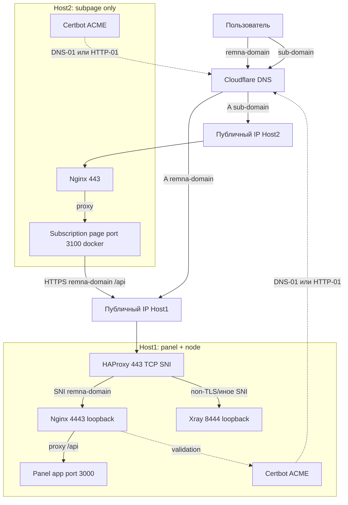

# 🚀 VFF Remnawave Auto Deployment

Полностью автоматизированное развертывание **Remnawave Panel**, **Remnawave Nodes**, **Subscription Page**  
и полная миграция данных **Marzban → Remnawave** (inbounds, hosts, users).

---

## ⚙️ Основные возможности

- Автодеплой **панели Remnawave**
- Автодеплой **нод** + автоматическая регистрация в панели
- Автодеплой **страницы подписки** (bundled / separate)
- Управление сертификатами (HTTP‑01 / DNS‑01)
- Интеграция с HAProxy (TLS passthrough, SNI‑routing)
- Полная **миграция данных Marzban → Remnawave**
  - inbound VLESS Reality
  - hosts (node-host configs)
  - users (включая uuid, трафик, статус, срок действия)
- Legacy Router: поддержка старых ссылок формата  
  `https://<domain>/sub/<marzban_token>`
- Smoke‑тесты панели, нод и страницы подписки
- Полный decommission нод

---

## ⚙️ Основные команды

### Развернуть панель
```bash
make panel
```

После успешного развёртывания панели:
1. Зайдите в веб-интерфейс панели под `admin`.
2. Перейдите в **Settings → API Tokens → Create Token**.
3. Скопируйте значение токена (`ey...`) и сохраните в:
   ```bash
   inventory/group_vars/panel/vault.yml
   ```
   пример:
   ```yaml
   vault_remnawave_panel_api_token: "eyJhbGciO..."
   ```

   > Этот токен используется для API-вызовов и автоматического добавления inbound’ов.

---

### Настроить DNS через Cloudflare
```bash
make dns LIMIT=panel TAGS=cf_dns
```

---

### ➕ Добавить inbound (после панели, до нод)
После того как панель развернута и токен добавлен в vault, можно автоматически добавить Reality-inbound в профиль панели:

```bash
make inbounds
```

Примеры:
```bash
# ограничить по хосту
make inbounds LIMIT=panel

# явно указать UUID профиля
make inbounds EXTRA='-e remnawave_profile_uuid=7988e3a1-5a32-461a-9136-c9475e92f19a'
```

Inbound будет создан или обновлён идемпотентно (по `tag`), а затем автоматически зарегистрирован во **внутреннем скваде** `Default-Squad`.

> Подробности см. в [docs/remnawave_inbounds.md](docs/remnawave_inbounds.md)

---

### Развернуть страницу подписки
Разворачивает отдельный контейнер **Remnawave Subscription Page**, проксируемый через Nginx (порт 443 или 4443).

```bash
make sub
```

Примеры:
```bash
# если страница подписки на том же хосте, что и панель
make sub LIMIT=panel

# если на отдельном сервере
make sub LIMIT=sub-host
```

После развёртывания:
- Сертификат для `sub.vpn-for-friends.com` будет автоматически получен (DNS‑01 или HTTP‑01);
- Контейнер `remnawave-subscription-page` будет запущен и доступен по HTTPS;
- Для режима «bundled» (на том же хосте) страница подписки обращается к панели через локальный alias `remnawave`;
- Для режима «separate» — через публичный API `https://remna.vpn-for-friends.com/api`.

> Подробности см. в [docs/remnawave_subscription_deploy.md](docs/remnawave_subscription_deploy.md)

### Развернуть ноду
Перед развёртыванием ноды необходимо:

1. В панели на вкладке **Nodes → Add Node** создать ноду и скопировать её `SECRET_KEY` (строку вида `eyJu...`).
2. Сохранить этот ключ в vault конкретной ноды:
   ```bash
   inventory/host_vars/de-fra-1/vault.yml
   ```
   пример:
   ```yaml
   remnawave_secret_key: "eyJu..."
   ```

После этого можно запускать ноду:
```bash
make nodes LIMIT=de-fra-1 TAGS=node
```

---

### Зарегистрировать ноду в панели
```bash
make nodes LIMIT=node-name TAGS=register_node
```

### Зарегистрировать Host для ноды
```bash
make nodes LIMIT=node-name TAGS=register_host
```

### Smoke-тесты
```bash
make nodes LIMIT=node-name TAGS=smoke_node
```

---

## 🧹 Вывод ноды из эксплуатации (Decommission)

Когда ноду нужно **корректно вывести из работы** (например, при обновлении или замене), процесс выполняется в три шага:

1. **Отключить ноду и её хосты**
   ```bash
   make disable-node EXTRA='-e remnawave_node_name=de-fra-1 -e remnawave_enable_state=false -e remnawave_disable_hosts_of_node=true'
   ```
   Роль: [docs/remnawave_disable_node.md](docs/remnawave_disable_node.md)

2. **Дождаться завершения активных сессий**
   - Убедитесь через панель или Grafana, что активных соединений нет.
   - При необходимости можно запустить smoke-тесты:
     ```bash
     make nodes LIMIT=de-fra-1 TAGS=smoke_node
     ```

3. **Удалить ноду (и связанные хосты)**
   ```bash
   make delete-node EXTRA='-e remnawave_node_name=de-fra-1 -e remnawave_delete_hosts=true'
   ```
   Роль: [docs/remnawave_delete_node.md](docs/remnawave_delete_node.md)

> 🔒 Обе операции безопасны и идемпотентны — повторный запуск не приведёт к ошибкам.

---

## 🔄 Миграция данных Marzban → Remnawave

В репозитории присутствуют три специализированные роли, позволяющие **полностью перенести конфигурацию** из существующего Marzban-кластера в Remnawave:

- **Inbound VLESS TCP Reality**  
  `roles/remnawave_migrate_inbound`

- **Hosts (пулы адресов / Domain Bindings)**  
  `roles/remnawave_migrate_hosts`

- **Users (статусы, лимиты, UUID, squads, expireAt)**  
  `roles/remnawave_migrate_users`

Все роли поддерживают **DRY-RUN**, работают идемпотентно и допускают повторный запуск без побочных эффектов.

---

### ▶️ Миграция inbound (VLESS TCP REALITY)

Переносит профиль Reality из Marzban в Remnawave, маппируя:

- публичный ключ сервера,
- shortId,
- serverName,
- поток реальности,
- параметры VLESS,
- теги,
- слушающие адреса.

```bash
make migrate-inbound
```

Примеры:

```bash
# Только посмотреть, что будет создано/обновлено
make migrate-inbound EXTRA='-e remnawave_migrate_inbound_dry_run=true'
```

Подробности:  
👉 `docs/remnawave_migrate_inbound.md`

---

### ▶️ Миграция Hosts

Переносит host-binding’и (доменные имена, режимы, привязку к inbound'ам).

```bash
make migrate-hosts
```

Примеры:

```bash
# DRY-RUN без внесения изменений
make migrate-hosts EXTRA='-e remnawave_migrate_hosts_dry_run=true'
```

Документация:  
👉 `docs/remnawave_migrate_hosts.md`

---

### ▶️ Миграция пользователей

Самая сложная часть миграции — перенести всех пользователей Marzban:

- username / note  
- статус (active / disabled / limited / expired)  
- trafficLimit + стратегия  
- expireAt → перевод unix-timestamp → ISO8601  
- VLESS UUID — перенос 1:1  
- squads (опционально)  
- описание  
- фильтрация по `usernames=[...]`  

Команда:

```bash
make migrate-users LIMIT=panel
```

Примеры:

```bash
# Полный DRY-RUN всех пользователей
make migrate-users LIMIT=panel EXTRA='-e remnawave_migrate_users_dry_run=true'

# DRY-RUN только одного пользователя
make migrate-users LIMIT=panel EXTRA='-e remnawave_migrate_users_dry_run=true -e remnawave_migrate_users_usernames=["us_67"]'

# Применить реальные изменения для конкретного пользователя
make migrate-users LIMIT=panel EXTRA='-e remnawave_migrate_users_dry_run=false -e remnawave_migrate_users_usernames=["us_67"]'
```

Роль гарантирует:

- идемпотентность: существующий пользователь → PATCH, нового → POST  
- никакого «добавления _ в конце» (строгая нормализация)  
- уведомления в выходном логе о `create` или `update`  

Документация:  
👉 `docs/remnawave_migrate_users.md`

---

## 📚 Документация

| Раздел | Файл | Описание |
|--------|------|----------|
| Панель | [docs/remnawave_panel.md](docs/remnawave_panel.md) | Установка панели и сервисов |
| Inbounds | [roles/remnawave_inbounds/README.md](roles-remnawave_inbounds-README.md) | Добавление и регистрация inbound’ов |
| HAProxy | [docs/haproxy_tls_sni.md](docs/haproxy_tls_sni.md) | Совместная работа панели и Xray |
| Ноды | [docs/remnawave_node.md](docs/remnawave_node.md) | Запуск контейнера с SECRET_KEY |
| Регистрация ноды | [docs/remnawave_register_node.md](docs/remnawave_register_node.md) | API-регистрация ноды |
| Регистрация Host | [docs/remnawave_add_host.md](docs/remnawave_add_host.md) | Добавление Host через API |
| Subscription Deploy | [docs/remnawave_subscription_deploy.md](docs/remnawave_subscription_deploy.md) | Развёртывание страницы подписки |
| Subscription Page | [docs/remnawave_subscription_page.md](docs/remnawave_subscription_page.md) | Конфигурация Nginx и Docker контейнера |
| Проверки | [docs/smoke_tests.md](docs/smoke_tests.md) | Smoke-тесты панели и нод |
| Отключение ноды | [docs/remnawave_disable_node.md](docs/remnawave_disable_node.md) | Временное отключение ноды и хостов |
| Удаление ноды | [docs/remnawave_delete_node.md](docs/remnawave_delete_node.md) | Полное удаление ноды и связанных хостов |
| **Миграция Inbound** | **[docs/remnawave_migrate_inbound.md](docs/remnawave_migrate_inbound.md)** | Перенос Reality-inbound |
| **Миграция Hosts** | **[docs/remnawave_migrate_hosts.md](docs/remnawave_migrate_hosts.md)** | Перенос Host-binding’ов |
| **Миграция Users** | **[docs/remnawave_migrate_users.md](docs/remnawave_migrate_users.md)** | Полная миграция пользователей |

---

## 🧱 Архитектура развертывания

### Вариант 1 — Панель и страница подписки на одном хосте



---

### Вариант 2 — Панель и страница подписки на разных хостах



---

## 🔒 Vault и секреты

```
inventory/group_vars/all/vault.yml
inventory/group_vars/panel/vault.yml
inventory/host_vars/<node>/vault.yml
```

> **Не коммитим** содержимое Vault в git.  
> Используйте `ansible-vault edit` для безопасного редактирования файлов.

---

## ✅ Проверка после развёртывания

```bash
curl -vk https://panel.example.com/health
docker logs remnanode --tail=50
echo | openssl s_client -connect IP:443 -servername panel.example.com
echo | openssl s_client -connect IP:443 -servername www.cloudflare.com
```

---

## Поддержка и вклад

PR приветствуются: дополнения к ролям, новые дашборды и правила, улучшения документации. Старайтесь сопровождать изменения коротким описанием и примерами проверки.

---

© [VPN for Friends](https://t.me/vpn_for_myfriends_bot) · Monitoring Stack
